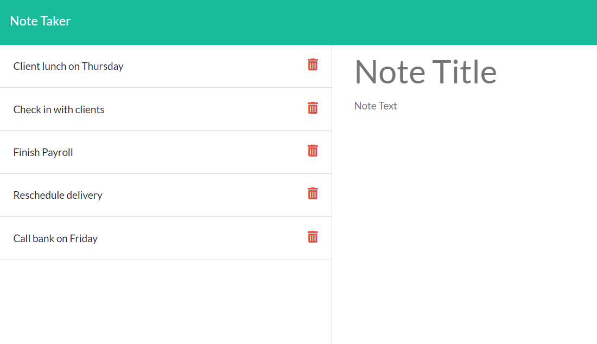

# Note Taker

## Table of Contents for Note Taker
- [Description](#description)
- [Installation](#installation)
- [Usage](#usage)
- [License](#license)
- [Contributing](#contributing)
- [Tests](#tests)
- [Questions](#questions)
- [Heroku](#heroku)

### Description
An application that can be used to write and save notes. This application uses Express.js back end and saves and retrieves note data from a JSON file

### Installation
Run npm install and then npm start to run the server, or you can take a look at the live server on Heroku

### Usage
This app is used to write and save notes

### License

No License selected

### Contributing
Feel free to use this as your own notebook of sorts

### Tests
npm install and npm start

### Questions
If you have any questions, feel free to contact me via email, vdurham@prideseals.com, or visit my Github page at [vidurham](https://github.com/vidurham).

### Heroku
[Heroku Link](https://note-taker-2244.herokuapp.com/)

### Screenshot
